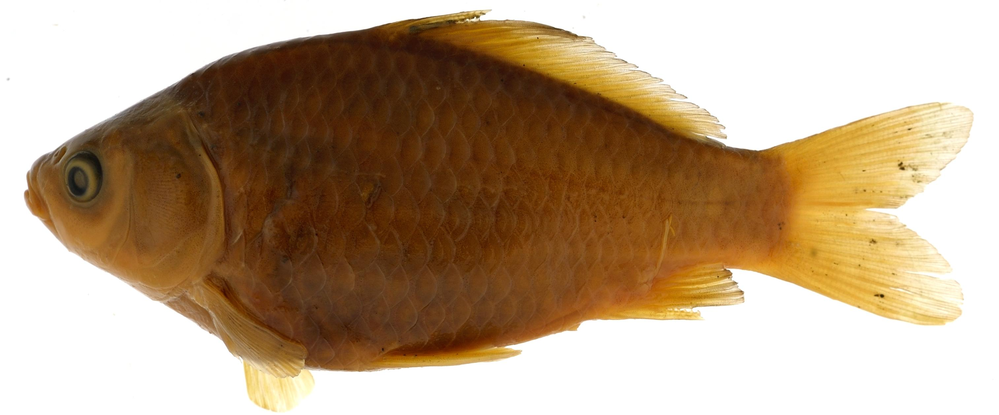

# Crop_image
Small repository to store the "copping"step of the BGNN Fish project.

This repo is linked to main BGNN Fish project rpo [BGNN_Snakemake](https://github.com/hdr-bgnn/BGNN_Snakemake) that encompasses a complete analysis workflow. It contained the code for the "Cropping" part [see here](https://github.com/hdr-bgnn/BGNN_Snakemake/blob/main/Picture_for_Documentation/Workflow_stage_1.png). It is easier to understand the purpose this code and its application if you are familar with BGNN_Snakemake repo.

## 1 - Short description

  + We use raw fish image [available at Tulane](http://www.tubri.org/HDR/INHS/) and Metadata json file generated by [Drexel_metadata_rformatter] (https://github.com/hdr-bgnn/drexel_metadata_formatter) to crop the fish out of a more complexe image.
  + The metadata json file contained the bounding box of the fish which use to crop the fish [here is an example](Test_data/INHS_FISH_000742_cropped.jpg). We increase the size of the bounding box around the fish by default by 5%  (see `--increase` parameter), to reduce the chance that the bounding box (from the metadata) would cut the edge of the fish.

**input**


**Cropped output**


## 2 - Usage

Input example : 
  + fish image .jpg [see INHS_FISH_000742.jpg](Test_data/INHS_FISH_000742.jpg)
  + Metadata.json [see INHS_FISH_000742.json](Test_data/INHS_FISH_000742.json)
  
Ouput :
  + Cropped image .jpg [see INHS_FISH_000742_cropped.jpg]Test_data/INHS_FISH_000742_cropped.jpg)

Usage in python
you need the environment define by crop_env.yml. I suggest to use anaconda or miniconda as environment manager

```
Crop_image_main.py [-h] [--increase] input_image imput_metadata output
```

Example using the Test_data with 10% increase in size

```
Crop_image_main.py INHS_FISH_000742.jpg INHS_FISH_000742.json INHS_FISH_000742_cropped.jpg --increase 0.10
```

The `increase` parameter defines the percentage increase of the bounding box from the original metadata size in percentage for each direction (in this example 10% increase in width and in height is written as 0.10). The default value in 0.05.

## 3 - Container and test

The container can be download here:

```
docker pull ghcr.io/hdr-bgnn/crop_image:latest
#or 
singualarity docker://ghcr.io/hdr-bgnn/crop_image:latest
```

Container Usage: 

In this section the name of the container "crop_image_0.0.2.sif" will depend on the version you are downloading or the name you give to container .sif 

The usage can be display like this: 

```
singularity run crop_image_0.0.2.sif
```

To execute the code on the test images [test data](Test_data/), run the following

```
singularity exec crop_image_0.0.2.sif Crop_image_main.py Test_data/INHS_FISH_000742.jpg Test_data/INHS_FISH_000742.json Test_data/INHS_FISH_000742_cropped_test.jpg
```

